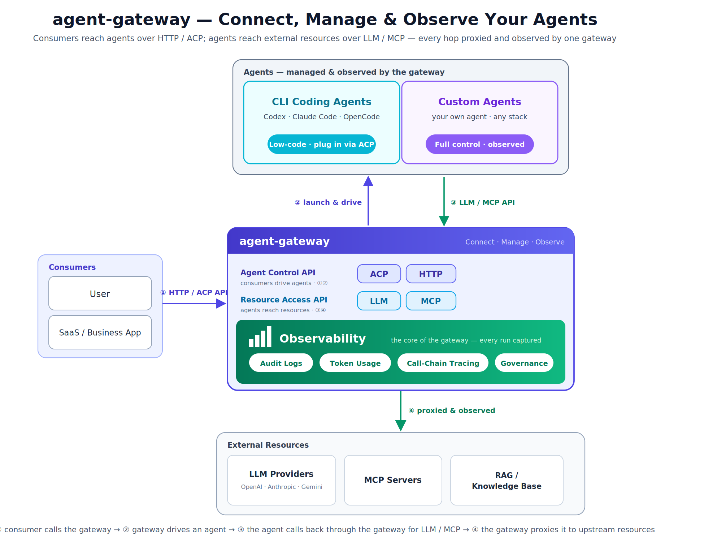

# agent-gateway

`agent-gateway` is an AI gateway for LLM, MCP, and native ACP workloads. It provides OpenAI-compatible and Anthropic-compatible ingress, route-based provider dispatch, VirtualKey authentication, dynamic config backed by SQLite, and Admin APIs for gateway operations.

This repository builds three binaries:

- `agw`: Caddy-based gateway runtime
- `agwd`: standalone gateway daemon
- `agwctl`: management CLI for gateway and local CLI auth flows

## What It Does

- expose OpenAI-compatible and Anthropic-compatible HTTP APIs
- route requests to direct providers or logical model targets
- manage providers, routes, VirtualKeys, credentials, and CLI auth through an Admin API
- support MCP gateway routing, discovery, execution, and runtime inspection
- expose the first native ACP control surface for codex/opencode agent routing
- run with either a Caddyfile-based runtime or a standalone daemon with a config store

## Architecture



`agent-gateway` is a multi-protocol gateway that connects, manages, and observes AI agents on a single binary. It exposes two distinct API surfaces, one for each direction of traffic:

- **Agent Control API (ACP / HTTP)** — how consumers reach agents. Users and business apps call the gateway to launch and drive an agent.
- **Resource Access API (LLM / MCP)** — how agents reach the outside world. An agent calls back through the gateway to use LLM providers and MCP tools.

A typical request flows in four hops: ① a consumer calls the gateway over HTTP / ACP → ② the gateway launches and drives an agent → ③ the agent calls back through the gateway for LLM / MCP → ④ the gateway proxies that call to upstream resources (LLM providers, MCP servers, RAG). Because both directions pass through the gateway, it adds VirtualKey auth, routing, and config across the board, and observability is first-class: every hop is captured as audit logs, token usage, and call-chain traces for multi-agent governance.

The gateway supports two integration paths for the agents themselves:

- **Low-code**: drive off-the-shelf CLI coding agents (Codex, Claude Code, OpenCode) directly over ACP — no custom code required.
- **Full control**: bring your own agent in any stack and let the gateway manage and observe it.

## Quick Start

Build the binaries:

```bash
make build
```

Keep the Caddyfile minimal and declare providers, routes, and VirtualKeys in bundle YAML files applied at runtime via `agwctl gateway apply`.

Create a minimal `Caddyfile` (no providers or routes). LLM providers and routes can also be declared statically in the Caddyfile; see [docs/getting-started/quickstart-llm.md](docs/getting-started/quickstart-llm.md) for that flow:

```caddy
{
	admin localhost:2019

	agent_gateway {
		config_store sqlite {
			path ./data/configstore.db
		}
	}
}

http://localhost:8019 {
	route /admin/* {
		basic_auth {
			admin <hashed-password>
		}
		agent_gateway_admin
	}
}

http://127.0.0.1:8080 {
	agent_route_dispatcher {
		llm_api openai
		llm_api anthropic
		llm_api cc
		mcp
		acp
	}
}
```

Generate the hash with `./agw hash-password --plaintext 'your-password'` and run the gateway:

```bash
./agw hash-password --plaintext 'your-password'
OPENAI_API_KEY=sk-... ./agw run --config ./Caddyfile
```

## LLM Quick Start

Declare an LLM provider, route, and VirtualKey in a bundle YAML applied at runtime via `agwctl gateway apply`.

Create a bundle file `gateway.bundle.yaml`:

```yaml
apiVersion: gateway.agw/v1alpha1
kind: GatewayBundle
providers:
  - id: openai-main
    provider_type: openai
    api_key: ${OPENAI_API_KEY}
    default_model: gpt-4.1
    options:
      compact: none
llmRoutes:
  - id: openai-chat
    protocol: openai
    match_policy:
      path_prefix: /
    auth_policy:
      require_virtual_key: true
    target_policy:
      provider_target:
        provider_id: openai-main
virtualKeys:
  - id: test-key
    allowed_route_ids:
      - openai-chat
```

Set the admin Basic Auth credentials for agwctl as an environment variable, then apply the bundle:

```bash
export AGW_ADMIN_BASIC_AUTH=admin:your-password

OPENAI_API_KEY=sk-... ./agwctl gateway apply -f gateway.bundle.yaml
```

`apply` is idempotent — it creates objects that do not exist, updates those that have changed, and skips unchanged ones:

```
gateway apply: gateway.bundle.yaml
  create provider openai-main
  create llm_route openai-chat
  create virtual_key test-key
summary: create=3 update=0 skip=0 error=0
```

Retrieve the generated VirtualKey value and verify with `agwctl chat`:

```bash
AGW_API_KEY=$(./agwctl gateway virtualkey get test-key | jq -r '.key')
./agwctl chat "hello" --api-key "$AGW_API_KEY"
```

`agwctl chat` defaults to the OpenAI API at `http://127.0.0.1:8080/v1`. Pass `--stream` for SSE streaming, `--api anthropic` for the Anthropic-compatible surface, or `--api cc` for the Claude Code CLI-compatible surface.

The `AGW_ADMIN_ADDR` environment variable sets the admin API address (default: `http://localhost:8019`). Run `agwctl gateway export` to dump the current gateway state as a bundle YAML.

Provider `options.compact` selects compatibility request shaping. In Caddyfile provider blocks, configure it as `option compact <cc|codex|none>`. In bundle YAML, configure it as `options.compact`. Providers ignore modes they do not implement.

## MCP Quick Start

The MCP gateway uses the same minimal Caddyfile as the Quick Start. Enable `mcp` in the dispatcher, then apply an MCP bundle.

Create or reuse the minimal Caddyfile from the Quick Start above (the `mcp` directive is already present in `agent_route_dispatcher`). Run the gateway, then create a bundle file `gateway.bundle.mcp.yaml`.

**Streamable HTTP upstream** (remote MCP server over HTTP):

```yaml
apiVersion: gateway.agw/v1alpha1
kind: GatewayBundle
mcpServices:
  - id: mcp-main
    name: Main MCP Service
    transport: streamable_http
    url: ${MCP_SERVICE_URL}
mcpRoutes:
  - service_id: mcp-main
    match_policy:
      path_prefix: /mcp
    auth_policy:
      require_virtual_key: true
virtualKeys:
  - id: mcp-key
    allowed_route_ids:
      - mcp:mcp-main:/mcp
```

**stdio upstream** (local subprocess, e.g. `@modelcontextprotocol/server-filesystem`):

```yaml
apiVersion: gateway.agw/v1alpha1
kind: GatewayBundle
mcpServices:
  - id: mcp-fs
    name: Filesystem MCP Service
    transport: stdio
    command: npx
    args: ["-y", "@modelcontextprotocol/server-filesystem", "/tmp"]
mcpRoutes:
  - service_id: mcp-fs
    match_policy:
      path_prefix: /mcp
    auth_policy:
      require_virtual_key: true
virtualKeys:
  - id: mcp-key
    allowed_route_ids:
      - mcp:mcp-fs:/mcp
```

Apply and verify:

```bash
export AGW_ADMIN_BASIC_AUTH=admin:your-password

MCP_SERVICE_URL=https://your-mcp-server/mcp ./agwctl gateway apply -f gateway.bundle.mcp.yaml

# Discover tools via admin API
./agwctl gateway mcp-service tools mcp-main

# Retrieve the VirtualKey and send an MCP request
MCP_API_KEY=$(./agwctl gateway virtualkey get mcp-key | jq -r '.key')

curl -s http://127.0.0.1:8080/mcp \
  -H 'Content-Type: application/json' \
  -H "Authorization: Bearer $MCP_API_KEY" \
  -d '{"jsonrpc":"2.0","id":1,"method":"tools/list"}'
```

MCP route IDs are auto-generated as `mcp:<service_id>:<path_prefix>` when `id` is omitted. See [docs/getting-started/quickstart-mcp.md](docs/getting-started/quickstart-mcp.md) for the full walkthrough.

## ACP Quick Start

The ACP gateway uses the same minimal Caddyfile as the Quick Start. Enable `acp` in `agent_route_dispatcher`, then apply ACP service and route objects dynamically with `agwctl`.

Native ACP support is implemented in this repository. The gateway owns ACP route/service config, VirtualKey auth, Admin APIs, `POST /<acp-route>/turn` SSE streaming, runtime pooling, transcript replay, and permission handling. `opencode` launches the fixed `opencode acp --cwd <cwd>` shape; `codex` launches the fixed external ACP adapter binary `codex-acp` by default.

For Codex, install the adapter and create the working directory:

```bash
npm install -g @zed-industries/codex-acp
mkdir -p /tmp/acp-codex-test
```

Create a bundle file `gateway.bundle.acp.yaml`:

```yaml
apiVersion: gateway.agw/v1alpha1
kind: GatewayBundle

acpServices:
  - id: codex-main
    name: Codex
    agent_type: codex
    cwd: /tmp/acp-codex-test
    max_instances: 4
    permission_mode: auto_approve

acpRoutes:
  - id: acp-codex
    service_id: codex-main
    match_policy:
      path_prefix: /acp/codex
    auth_policy:
      require_virtual_key: true

virtualKeys:
  - id: acp-key
    allowed_route_ids:
      - acp-codex
```

Apply and verify:

```bash
export AGW_ADMIN_BASIC_AUTH=admin:your-password

./agwctl gateway apply -f gateway.bundle.acp.yaml

./agwctl gateway acp-service list
./agwctl gateway acp-route list
./agwctl gateway acp-runtime get
```

Send a streamed turn through the dispatcher:

```bash
ACP_API_KEY=$(./agwctl gateway virtualkey get acp-key | jq -r '.key')

curl -N -s http://127.0.0.1:8080/acp/codex/turn \
  -H 'Content-Type: application/json' \
  -H "Authorization: Bearer $ACP_API_KEY" \
  -d '{"thread_id":"t-demo-1","input":"Reply with exactly one word: pong"}'
```

List sessions or replay a transcript through the same ACP route and VirtualKey:

```bash
curl -s "http://127.0.0.1:8080/acp/codex/sessions?cwd=/tmp/acp-codex-test" \
  -H "Authorization: Bearer $ACP_API_KEY"

curl -s "http://127.0.0.1:8080/acp/codex/sessions/<session-id>/transcript" \
  -H "Authorization: Bearer $ACP_API_KEY"
```

Inspect sessions, replay transcripts, or operate on runtime state:

```bash
./agwctl gateway acp-service sessions codex-main --cwd /tmp/acp-codex-test
./agwctl gateway acp-service transcript codex-main <session-id>

./agwctl gateway acp-runtime inflight
./agwctl gateway acp-runtime resolve-permission <request-id> --outcome selected --option-id <option-id>
./agwctl gateway acp-runtime close-thread codex-main t-demo-1
```

ACP route IDs are auto-generated as `acp:<service_id>:<path_prefix>` when `id` is omitted. Permission modes are `deny`, `auto_approve`, and `interactive`; interactive requests are surfaced as `permission` SSE events and can be resolved through `POST /<acp-route>/permission` or the Admin API.

See [docs/getting-started/quickstart-acp.md](docs/getting-started/quickstart-acp.md), [docs/architecture/acp-architecture.md](docs/architecture/acp-architecture.md), [docs/reference/acp-technical-spec.md](docs/reference/acp-technical-spec.md), and [docs/reference/acp-api.md](docs/reference/acp-api.md) for the full ACP documentation.

## Runtimes

- `agw` uses a Caddyfile plus the shared config store
- `agwd` runs as a standalone daemon with `--config-store` and optional `--static-config`
- `agwctl` talks to the gateway Admin API, the Caddy admin API, or local CLI auth flows depending on the command

See [docs/README.md](docs/README.md) for runtime-specific guides and references.

## Documentation

- [docs/README.md](docs/README.md): documentation index and split plan
- [docs/architecture/architecture-overview.md](docs/architecture/architecture-overview.md): current architecture overview
- [docs/architecture/mcp-architecture.md](docs/architecture/mcp-architecture.md): MCP gateway architecture
- [docs/architecture/acp-architecture.md](docs/architecture/acp-architecture.md): ACP gateway architecture
- [docs/architecture/configstore-architecture.md](docs/architecture/configstore-architecture.md): config store architecture
- [docs/design/gateway-bundle-yaml.md](docs/design/gateway-bundle-yaml.md): bundle YAML design

## Current Limits

- OpenAI-compatible chat and Anthropic-compatible messages are the primary mature LLM paths
- OpenAI embeddings and Anthropic token counting are not fully implemented
- MCP is active in the dispatcher and Admin API surface, but some adjacent subsystems are still evolving
- ACP is a functional native route/admin/dispatcher surface with a reusable stdio runtime driver and thin codex/opencode agent adapters; crash retry and the in-repo Codex app-server bridge remain deferred
- metrics Admin APIs expose durable SQLite-backed summaries (with pipeline drop/failure counters), recent LLM/MCP/ACP interaction events, and aggregate breakdowns; a Prometheus exposition endpoint (`GET /admin/metrics/prometheus`) serves O(1) in-process counters, and an `OpenTelemetrySink` adapter seam remains available for a deployment-supplied push exporter
- memory and agents Admin API families still contain `501 Not Implemented` endpoints

## Development

Useful commands:

```bash
go test ./...
go test ./pkg/admin ./pkg/gateway ./pkg/dispatcher/...
go test ./pkg/llm/provider/...
```

```bash
./agw adapt --config ./Caddyfile
./agw run --config ./Caddyfile
```
